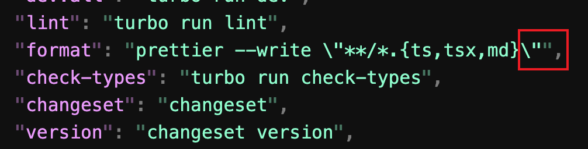

<h1 align="center">
  <br>
  
  <br>
  Kortin Theme for <a href="https://code.visualstudio.com/">VS Code</a>
  <br>
</h1>

<p align="center">
  <strong>Kortin's fantasy theme for Visual Studio Code</strong>
</p>

<p align="center">
  
  
</p>

<p align="center">
  <a href="#features">Features</a> •
  <a href="#installation">Installation</a> •
  <a href="#recommended-settings">Recommended Settings</a> •
  <a href="#license">License</a>
</p>


> 🚧 WIP: Still in progress!

## Screenshots
**Fantasy (immersive)**

<p align="center">
  
</p>

More language screenshot please see [screenshots](https://github.com/kortin99/vscode-kortin-theme/tree/main/screenshots)

## Features

- **High contrast design** - Better differentiation between code tokens for improved readability
- **De-emphasized punctuation** - Reduced visual prominence of non-essential punctuation for improved focus
- **Immersive dark theme** - Deep, rich colors create an immersive coding environment
  


## Installation

1. Open **Extensions** sidebar panel in VS Code. `View → Extensions`
2. Search for `Kortin Theme`
3. Click **Install** to install it
4. Click **Reload** to reload the editor
5. Code > Preferences > Color Theme > **Kortin Theme**

## Recommended Settings

For the best experience with this theme, consider the following settings:

```json
{
  "editor.fontFamily": "JetBrains Mono, Menlo, Monaco, 'Courier New', monospace",
  "editor.fontSize": 14,
  "editor.lineHeight": 2,
  "editor.fontLigatures": true
}
```

## License

This project is licensed under the MIT License - see the [LICENSE](LICENSE) file for details.
